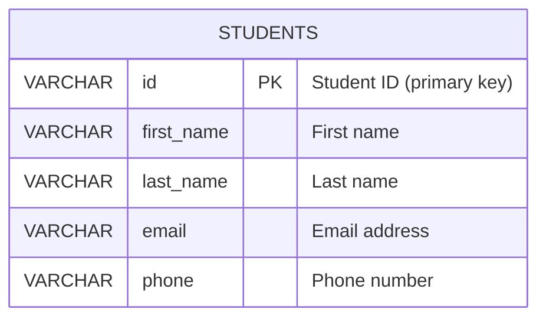

# Student Information System

## Introduction
This Student Information System (SIS) is a small, easy-to-run web application for managing basic student records. It demonstrates a complete CRUD (Create, Read, Update, Delete) workflow using a straightforward technology stack: HTML/CSS/JavaScript on the frontend and PHP + MySQL on the backend. The project is intended for learning, classroom exercises, or quick prototyping.

What this project does
- Provides a simple form to add or update student records (ID, first name, last name, email, phone).
- Shows all students in a searchable table.
- Allows deletion of records.
- Uses fetch() + JSON to communicate between frontend and backend, so you can see how asynchronous web apps interact with server APIs.

Submitted by: Princess P. Mendoza — BSCS 2B

---

## Entity-Relationship (ER)

This project uses a single entity: students

Mermaid diagram:


Fields (human-readable):
- id (PK, VARCHAR(20)) — Student identifier
- first_name (VARCHAR(50))
- last_name (VARCHAR(50))
- email (VARCHAR(100))
- phone (VARCHAR(20))

---

## API (short)
- GET `backend/get_students.php` — returns JSON list of students
- POST `backend/save_student.php` — add or update a student (JSON body)
- POST `backend/delete_student.php` — delete a student by id (JSON body)

Example request body for save:
```json
{ "id":"2026001", "first_name":"Jane", "last_name":"Doe", "email":"jane@example.com", "phone":"09171234567" }
```

---

## Troubleshooting tips
- If fetch() fails, ensure PHP files are reachable at the `backend/` path used in `script.js`.
- If DB connection fails, check credentials in `backend/db.php` and confirm MySQL is running.
- If using MySQL Workbench, connect to `localhost:3306` (default) and run `student_db.sql`.

---
